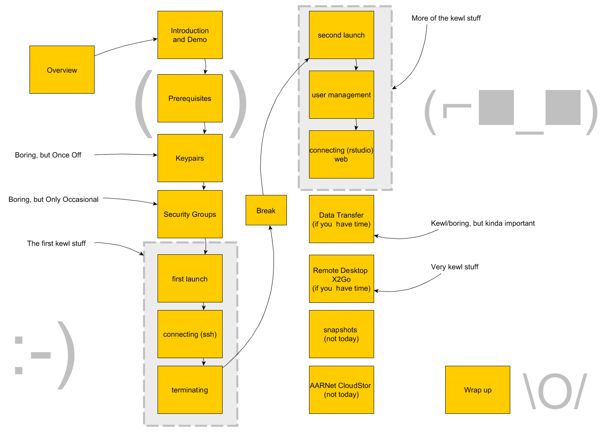

# Cloud Starter Mini, Resbaz 2017 Hobart
This is a scaled down version of Nectar Cloud Starter

# Starter topics
* Introduction and demo
    * Basic use cases
    * Some benefits
    * Dashboard tour
        * AAF
        * Projects/Projects drop down
        * Support
        * (Personal trial) allocations/Allocation requests
        * Left hand side panel
    * Launching demo
        * Launch dialog
        * name/flavour/image + key/security group + AZ
        * ip address
* Prerequisites 
    * we'll address section by section today, but the link is here: 
* Key pairs 
    * Demo
    * Activity (instructions here [http://tinyurl.com/creating-a-keypair](http://tinyurl.com/creating-a-keypair))
* Security groups 
    * Demo
    * Activity (instructions here [http://tinyurl.com/creating-a-security-group](http://tinyurl.com/creating-a-security-group))
* First launch
    * Demo
    * Activity (instructions here: [http://tinyurl.com/starting-an-instance](http://tinyurl.com/starting-an-instance))
* Connecting (ssh)
    * Demo 
    * Activity
        * Mac: [http://tinyurl.com/apple-ssh-md](http://tinyurl.com/apple-ssh-md)
        * Wind	ows MobaXTerm [http://tinyurl.com/windows-ssh-moba](http://tinyurl.com/windows-ssh-moba)
* Terminating
    * Terminate it using the Instance Action Menu
* Availability zones
    * Show and tell

* Second Launch, and
* User Management, and
* Connect RStudio (web)
    * Activity (instructions here: [Resources/LaunchTPACRStudioServer.md](Resources/LaunchTPACRStudioServer.md))
    * 

# Further topics

* Data Transfer (scp or sftp clients)
* Remote Desktop connectivity using X2Go
* Snapshots (not included)
* AARNet CloudStor
