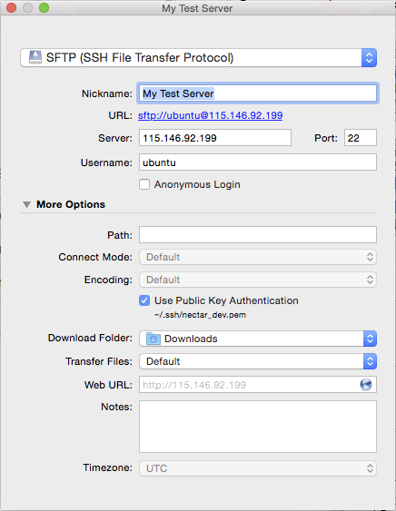

#Lesson IV: Moving data to and from your new computer (30min)

> Whilst on the machine, Anna realises that she doesn't have a backup of the site that she's created. And thinks
> that it would be a good time to create one!

There is a command line program you can use called `scp` (**s**ecure **c**o**p**y) to move files to, or fetch files 
from, different machines. It is built on top of `ssh`.

This `scp` command will copy the file named `notes.txt` from the home directory of the remote machine to the local one:

```bash
$ scp username@remote_machine_address:notes.txt /local/directory 
```

Where of course `username` is the default account on the remote machine, and `remote_machine_address` is either its
IP number or its domain name.

This scp command will copy the file named notes.txt from the local machine to the remote machine:

```bash
$ scp foobar.txt username@remote_machine_address:/remote/directory 
```

Looking at the two commands you can see that the source for the transfer is on the left, and the target on the right.
You can use a wildcard denoted by the asterisk character (*) to copy multiple files in one go.

By way of example, I'm going to create a file locally, move it to the remote machine, then bring it back.

```bash
touch temp.txt
echo "hello from afar" > temp.txt 
more temp.txt
scp -i ~/.ssh/nectar_dev.pem temp.txt debian@115.146.92.130: 
ssh debian@115.146.92.130 -i ~/.ssh/nectar_dev.pem
    ls
    more temp.txt
    exit
pwd
ls
rm temp.txt
ls
scp -i ~/.ssh/nectar_dev.pem debian@115.146.92.130:temp.txt .
more temp.txt
rm temp.txt
```

**Exercise 8**

I want everyone to create a file named, say, `helpme.txt` and then copy it onto their remote server.

Hold up a Green card when you've managed to do this.
And a Red card if you need help.

For non existent bonus points, if you finish early, bring it back again!

**Exercise 9**

SCP is a good tool to have available. But a graphical environment can be much easier to use.

Go to [CyberDucks home page](https://cyberduck.io/) and download the client file that is correct for your laptop.

Then run it.

Hold up a Green card when you've managed to do this.
And a Red card if you need help.

**Exercise 10**


Right click and select "New Bookmark"


In the resultant dialogue select SFTP.
Provide a descriptive nickname for the bookmark.

For the Server provide the ip number of the machine read off of the dashboard.
Add 'ubuntu' as the Username.

Expand the 'More Options' drop down.



Select the "Use Public Authentication" checkbox, and in the resultant dialogue select the key file you used when you
launched the server. If in doubt, you can have a look at the server information tab on the dashboard.

Now close the dialogue. To connect to the server right click on the bookmark you've just created and select 
"Connect to Server". All going well, a ruled plain window should replace the pane showing the bookmarks. 

You should now be able to drag and drop files between the two machines! See if you can drag `helpme.txt` back to your
local machine. You can even edit it in place!

Hold up a Green card when you've managed to do this.
And a Red card if you need help.

In this lesson we've learnt two different ways of moving files between our remote server and our local machine.
Hence moving data to and from our NeCTAR servers should now not be a problem!